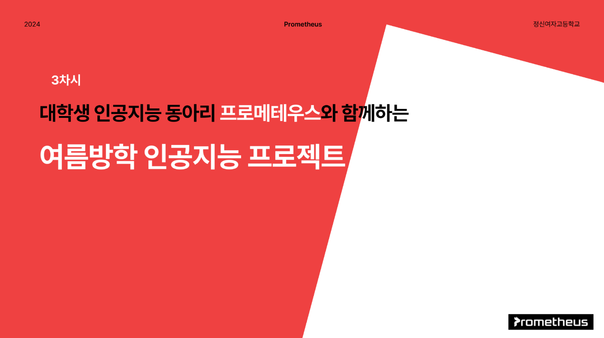
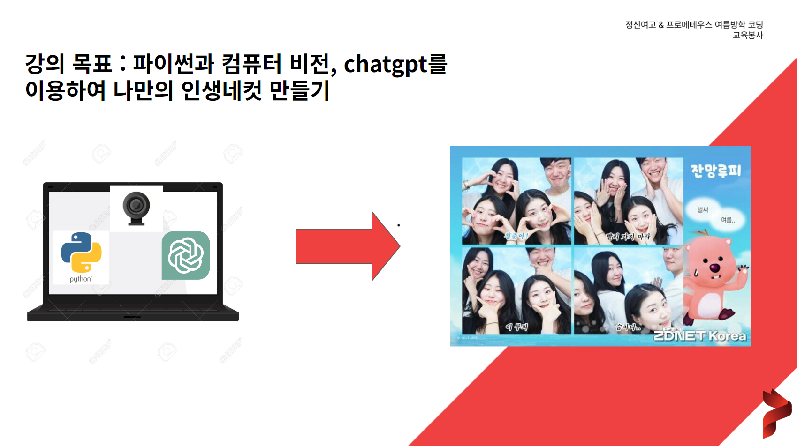
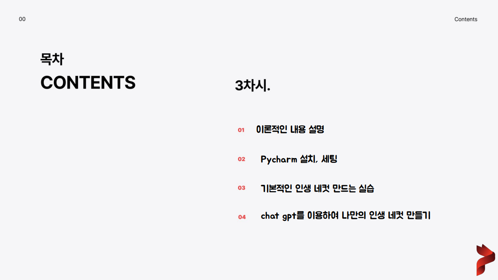
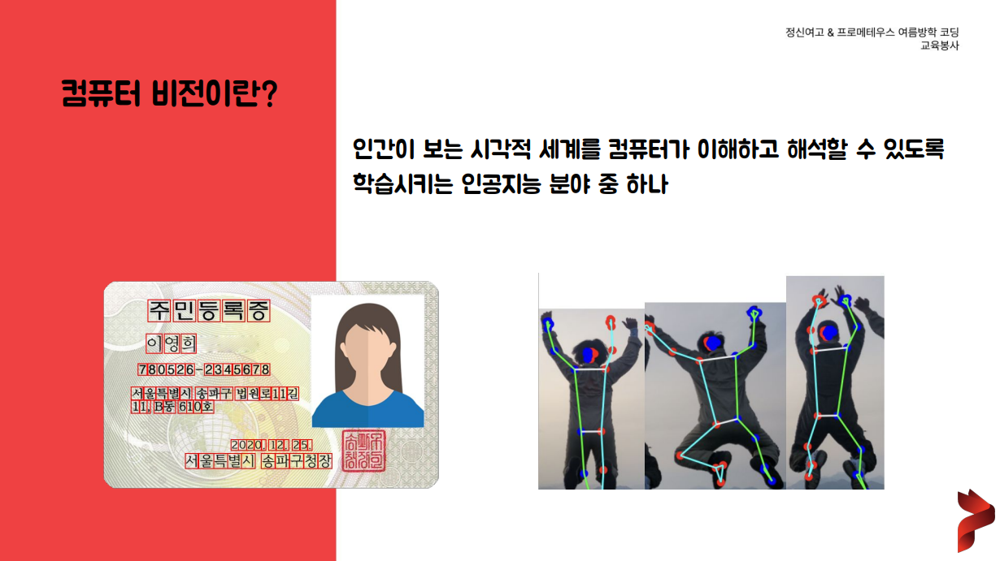
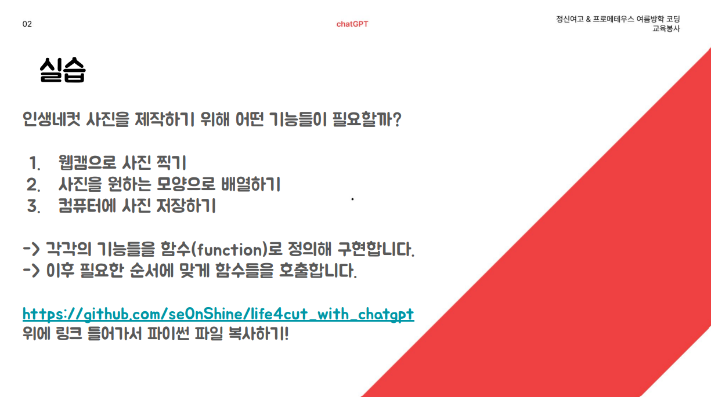
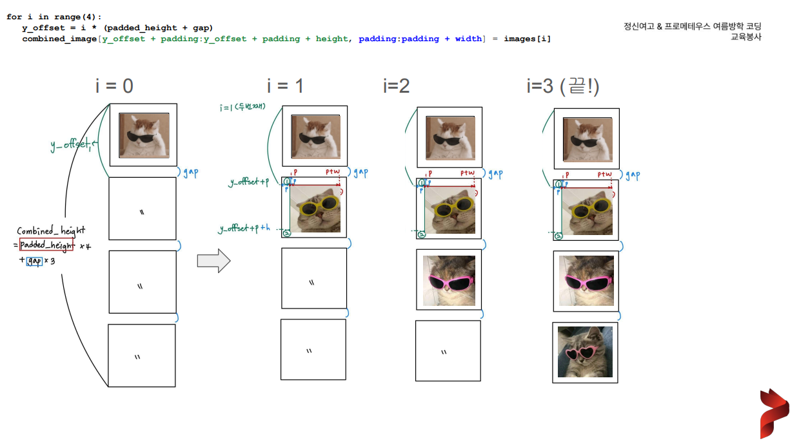
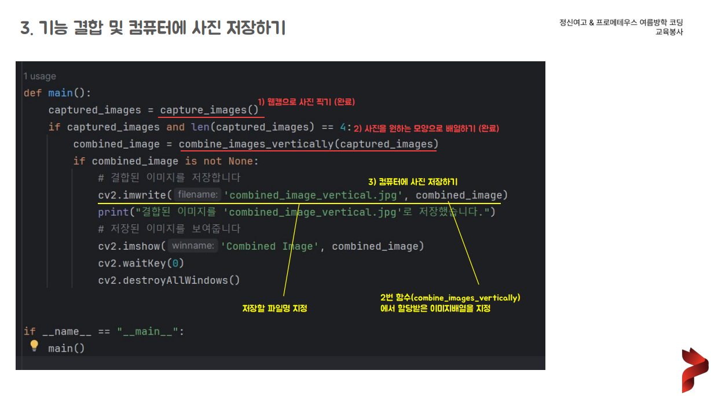
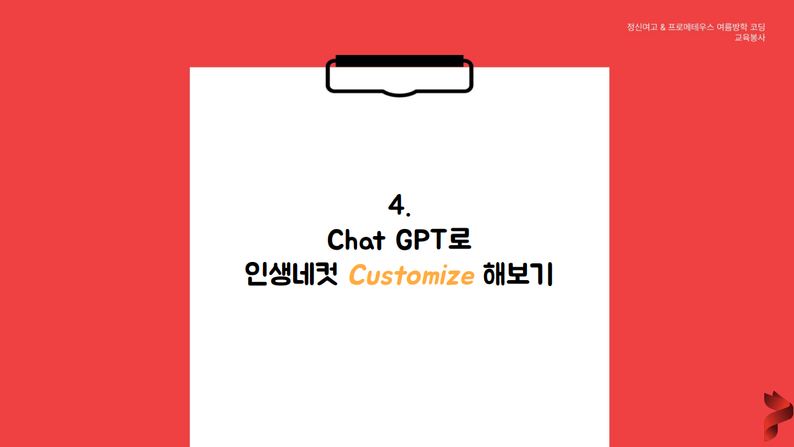
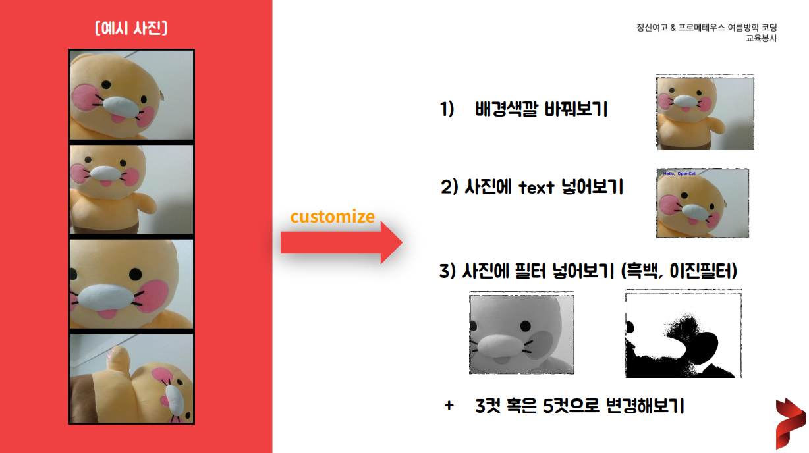

# 파이썬과 컴퓨터 비전, chatgpt를 이용하여 *나만의 인생네컷 만들기*
#### Notice : Pycharm 버전의 코드입니다.



## Overview
- 전체 수업 자료를 보시려면 *[클릭](./assets/step4.png)* 하세요.








  
## Directory Structure
```
life4cut_with_chatgpt/
├── assets/
├── src/
│ ├── custom/
│ │ ├── customize_background.py
│ │ ├── customize_filter_binary.py
│ │ ├── customize_filter_gray.py
│ │ └── customize_text.py
│ ├── 1st_step.py
│ ├── 2nd_step.py
│ └── 3rd_step.py
└── README.md
```

## Mentors
- 김예지 : https://github.com/jyhannakim 
- 윤재선 : https://github.com/se0nShine
- 오유진 : https://github.com/finallyupper